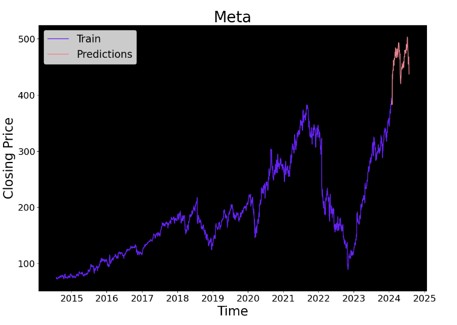
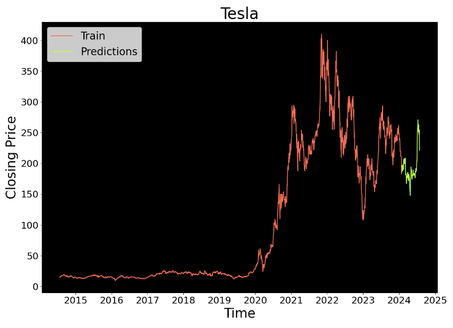
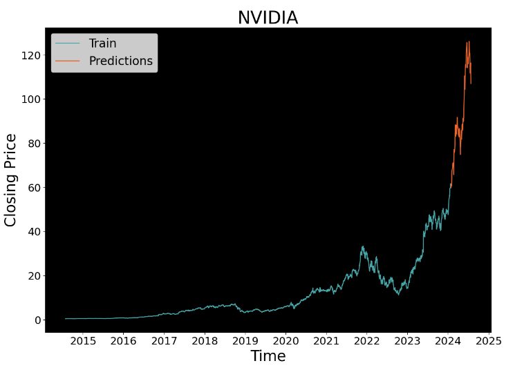
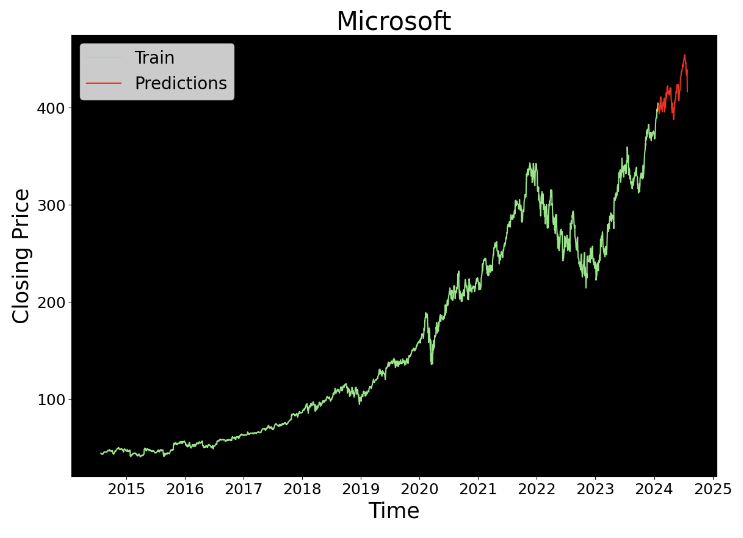
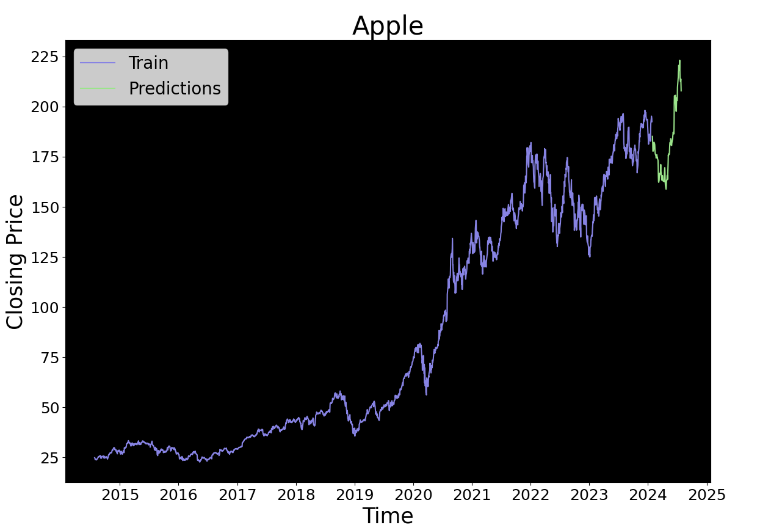

# Stock Price Forecasting Project

## About the Project
The stock price forecasting results for 5 leading technology companies: Meta (META), Tesla (TSLA), NVIDIA (NVDA), Microsoft (MSFT), and Apple (AAPL). This analysis uses three popular prediction models: LSTM (Long Short-Term Memory), ARIMA (AutoRegressive Integrated Moving Average), and FBProphet.

## Prediction Models
- **LSTM (Long Short-Term Memory):** A type of recurrent neural network (RNN) capable of learning order dependence in sequence prediction problems.
- **ARIMA (AutoRegressive Integrated Moving Average):** A class of statistical models for analyzing and forecasting time series data.
- **FBProphet:** A procedure for forecasting time series data based on an additive model where non-linear trends are fit with yearly, weekly, and daily seasonality.

## Results (LSTM)

### Meta (META)


### Tesla (TSLA)


### NVIDIA (NVDA)


### Microsoft (MSFT)


### Apple (AAPL)


## Conclusion
This project demonstrates the application of LSTM, ARIMA, and FBProphet models for forecasting the stock prices of leading technology companies. The results provide valuable insights for investors and analysts looking to predict future stock performance.

## Repository Structure
```plaintext
├── images
│   ├── meta_forecast.png
│   ├── tesla_forecast.png
│   ├── nvidia_forecast.png
│   ├── microsoft_forecast.png
│   ├── apple_forecast.png
├── README.md
├── data
│   ├── meta.csv
│   ├── tesla.csv
│   ├── nvidia.csv
│   ├── microsoft.csv
│   ├── apple.csv
├── models
│   ├── lstm_model.py
│   ├── arima_model.py
│   ├── fbprophet_model.py
└── notebooks
    ├── Top Global Companies Stock price Forecast.ipynb
